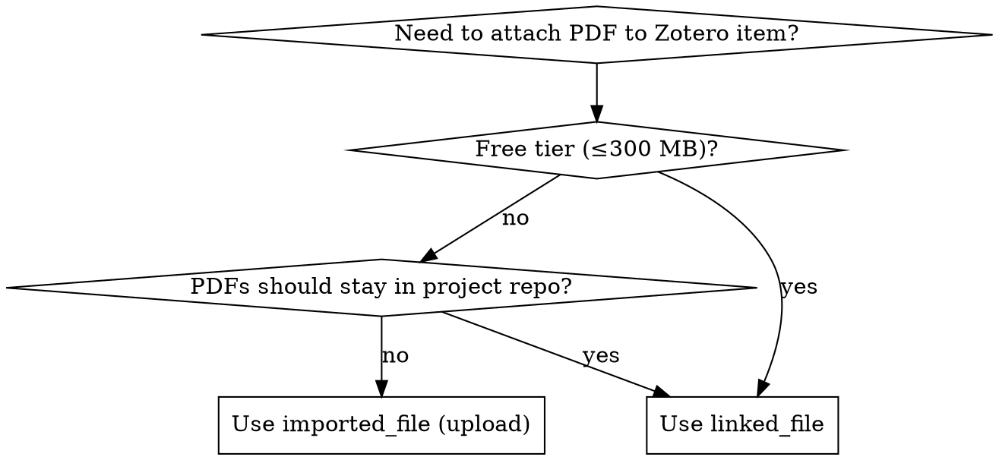

# zotero-arxiv-ingest

## Overview

Opinionated workflow for managing a CS/ML research project's literature with Zotero. Two design choices:

1. **Linked-file mode**: PDFs live under `<project>/related_work/` and Zotero stores only `linked_file` attachments pointing to absolute local paths. **No cloud storage is consumed.** Works on full free-tier accounts. Avoids the 300 MB quota wall entirely.
2. **arXiv-first ingestion**: One command per paper. Fetches metadata from arXiv Atom API, downloads PDF locally, creates the Zotero item with full metadata + tags + collection assignment + linked_file attachment, in one idempotent step.

Two scripts ship with this skill — `setup_collections.py` (one-time, build the collection tree) and `add_paper.py` (per-paper, repeatable).

## When to Use

- Starting a new research project and you want literature in Zotero + local files in the repo
- Quota error `413 Request Entity Too Large` / `File would exceed quota (X > 300)` on Zotero upload
- You want PDFs kept in git-ignored project folders, not Zotero cloud
- You need an idempotent, scriptable arXiv → Zotero pipeline
- Replacing a "drag and drop into Zotero desktop" habit with reproducible scripts

## When NOT to Use

- Non-arXiv sources as the primary input (use `pyzotero` skill directly or the `/research-init` command)
- Group libraries with paid storage where cloud upload is preferred
- You only want to read existing Zotero items (use `zotero-notes` or `zotero-review`)

## Quick Reference

| Task | Command |
|---|---|
| Get credentials | https://www.zotero.org/settings/keys → copy User ID + create private key (library + notes + write access) |
| Smoke test connection | `uv run --with pyzotero --with python-dotenv python -c "import os, dotenv, pyzotero.zotero as z; dotenv.load_dotenv('.env'); print(z.Zotero(os.environ['ZOTERO_LIBRARY_ID'], 'user', os.environ['ZOTERO_API_KEY']).count_items())"` |
| Build collection tree | `uv run --with pyzotero --with python-dotenv python ~/.claude/skills/zotero-arxiv-ingest/scripts/setup_collections.py --env <proj>/.env --tree-file <proj>/tree.json --out <proj>/related_work/.zotero_collections.json` |
| Add an arXiv paper | `uv run --with pyzotero --with python-dotenv python ~/.claude/skills/zotero-arxiv-ingest/scripts/add_paper.py --env <proj>/.env --root <proj>/related_work --arxiv 2404.16789 --collections-mapping <proj>/related_work/.zotero_collections.json --collection-path "CL_LLM/Surveys" --kind surveys --tags survey "continual learning"` |

## Canonical Project Layout

```
<project>/
├── .env                              # ZOTERO_LIBRARY_ID / API_KEY / TYPE (gitignored)
├── .env.example                      # template, committed
├── .gitignore                        # must list .env
├── related_work/
│   ├── README.md                     # human-readable index
│   ├── .zotero_collections.json      # {path -> key} mapping (committed)
│   ├── surveys/                      # PDFs of survey papers
│   ├── papers/                       # PDFs of method papers
│   └── notes/                        # Chinese / English reading notes
└── scripts/                          # optional project-level wrappers around the skill scripts
```

## Core Workflow (5 steps)

### Step 1 — credentials

User generates Zotero API key at <https://www.zotero.org/settings/keys>:
- Note the **User ID** at the top of the page (integer)
- Click **Create new private key**, tick **Allow library access** + **Allow notes access** + **Allow write access**, leave Default Group Permissions as None
- Copy the one-time-displayed key

Write `<project>/.env` (use `scripts/env.example` as template):

```
ZOTERO_LIBRARY_ID=<integer user id>
ZOTERO_API_KEY=<the key>
ZOTERO_LIBRARY_TYPE=user
```

Ensure `.env` is in `.gitignore` before saving the key.

### Step 2 — connectivity test

Always run a smoke test before anything else. `count_items()` is free and verifies the key works:

```bash
uv run --quiet --with pyzotero --with python-dotenv python <<'PY'
import os
from pathlib import Path
from dotenv import load_dotenv
from pyzotero import zotero
load_dotenv(Path("<project>/.env"))
zot = zotero.Zotero(os.environ["ZOTERO_LIBRARY_ID"], "user", os.environ["ZOTERO_API_KEY"])
print("items:", zot.count_items())
for c in zot.collections_top():
    print(" -", c["data"]["name"])
PY
```

If this fails with 403, the key is wrong or missing write permission. Stop and fix.

### Step 3 — build the collection tree

Write `tree.json` describing nested collections (any depth):

```json
{
  "CL_LLM": {
    "Surveys": {},
    "Continual Pre-Training (CPT)": {},
    "Domain-Adaptive Pre-training (DAP)": {},
    "Continual Fine-Tuning (CFT)": {
      "Continual Instruction Tuning (CIT)": {},
      "Continual Model Refinement (CMR)": {},
      "Continual Model Alignment (CMA)": {},
      "Continual Multimodal LLMs (CMLLMs)": {}
    }
  }
}
```

Then:

```bash
uv run --quiet --with pyzotero --with python-dotenv python \
  ~/.claude/skills/zotero-arxiv-ingest/scripts/setup_collections.py \
  --env <project>/.env \
  --tree-file tree.json \
  --out <project>/related_work/.zotero_collections.json
```

The script is **idempotent**: re-running with the same tree only creates missing nodes; the JSON output always reflects the live `{path -> key}` mapping (commit this file to git).

### Step 4 — add a paper

```bash
uv run --quiet --with pyzotero --with python-dotenv python \
  ~/.claude/skills/zotero-arxiv-ingest/scripts/add_paper.py \
  --env <project>/.env \
  --root <project>/related_work \
  --arxiv 2404.16789 \
  --kind surveys \
  --collections-mapping <project>/related_work/.zotero_collections.json \
  --collection-path "CL_LLM/Surveys" \
  --tags survey "continual learning" "large language models"
```

What the script does, in order:

1. Hits `http://export.arxiv.org/api/query?id_list=<id>` and parses Atom XML for title, authors, abstract, date, PDF URL
2. Computes PDF filename `<Surname><Year>_<Slug>.pdf` (50-char title slug)
3. Downloads PDF to `<root>/<kind>/<filename>` if not already present
4. Creates a `preprint` Zotero item (creators, abstractNote, archiveID, repository=arXiv, url, libraryCatalog, tags) inside the target collection — **skipped if an item with the exact same title already exists** (duplicate guard)
5. Attaches a `linked_file` attachment whose `path` is the absolute local PDF path — **skipped if already linked**
6. Deletes any orphan `imported_file` stubs left by previous failed uploads (`md5` empty)

### Step 5 — confirm in Zotero desktop

Open Zotero, click the new item, click the PDF attachment. It should open the local file directly via the file association.

## Decision: linked_file vs imported_file (cloud upload)



**Default for project libraries: `linked_file`.** It's the only option that keeps PDFs version-controllable, survives Zotero account closure, and never hits a quota.

## Common Errors

| Error | Cause | Fix |
|---|---|---|
| `413 Request Entity Too Large` / `File would exceed quota (X > 300)` | Free Zotero cloud quota exhausted | Switch to `linked_file` (this skill's default). If a half-created `imported_file` stub got left behind, `add_paper.py` will auto-clean it on the next run. |
| `403 Forbidden` on any API call | API key lacks write permission, or wrong library_id | Recreate the key with library + write + notes access; verify User ID is the integer from the keys page |
| `find_dotenv()` AssertionError with stdin heredoc | `load_dotenv()` with no args can't locate `.env` from a heredoc | Always pass an explicit path: `load_dotenv(Path("<project>/.env"))` |
| `Collection segment not found: 'X'` | Path in `--collection-path` doesn't match the tree mapping | Inspect `<project>/related_work/.zotero_collections.json`; rerun `setup_collections.py` if missing |
| New attachment doesn't open in Zotero desktop | Path in `linked_file` is relative or contains `~` | Always store absolute resolved path (`Path(...).resolve()`); `add_paper.py` already does this |
| Two duplicate items appear after rerun | Title comparison failed due to whitespace/case mismatch from arXiv | Normalise via `" ".join(title.split())` (already done in `add_paper.py`); investigate manually if it still triggers |

## Red Flags — STOP and re-check

- About to upload a PDF without checking the user's quota → switch to `linked_file`
- Hardcoding absolute paths inside the skill scripts → scripts should take `--root`, `--env`, never embed `/Users/...`
- Skipping the smoke test in Step 2 → 403 errors waste downstream time
- Creating collections without checking for existing same-named siblings → produces silent duplicates in Zotero (Zotero allows same-name collections under the same parent)

## Implementation

Two scripts under `~/.claude/skills/zotero-arxiv-ingest/scripts/`:

- `setup_collections.py` — idempotent collection tree builder (reads tree JSON, walks library, creates missing nodes, emits `{path -> key}` mapping)
- `add_paper.py` — single-paper arXiv ingestion (metadata + local PDF + linked_file attachment + tags + collection)
- `env.example` — `.env` template

Both scripts use `uv run --with pyzotero --with python-dotenv python <script>` for zero-install execution. No project-level `pyproject.toml` required.

## Related Skills

- `pyzotero` — low-level Zotero API reference; consult for fields/methods not covered here
- `/research-init` command — bigger workflow that adds literature search + analysis on top of Zotero setup; use that if you want it all in one shot
- `zotero-notes` / `zotero-review` — for reading & annotating items already in Zotero, downstream of this skill
